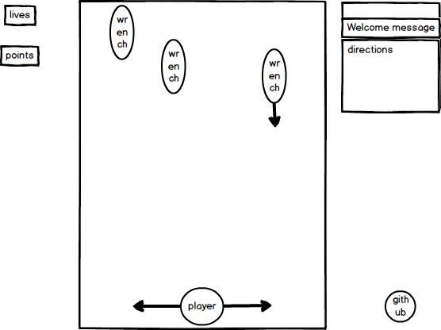

### Dodge a Wrench

### Background

Dodge a Wrench is a Javascript take on the Texas Instruments graphing calculator game, *Avalanche*.

The goal is to move left and right in order to avoid the incoming wrenches that will be thrown. The number of wrenches and speed will increase as time goes on.  When hit by a wrench, a life is lost, and when all lives are gone the game is over. Avoid getting hit by too many wrenches.

### MVP

- [ ] Ability to start, pause, and restart game
- [ ] Use &#8592;/&#8594; keys to move player from left to right.
- [ ] Increasing score as time passes.
- [ ] Registers hit and loses life.
- [ ] Power Ups / Bad Power Ups ex. shield / moving slower

### Wireframe

Game window in the center of the browser. Points and lives to the left of the game. Instructions and welcome message on the right. Github link, and any other links on the bottom right.

### Technologies
- JavaScript with `jquery` for logic.
- `HTML5 Canvas` with `Easel.js` used for render and DOM manipulation.
- Webpack for bundling.

Possible scripts involved in project:
- `wrench.js`: The objects coming top to bottom of game.
- `player.js`: The objected that will be controlled.
- `game.js`: Handle the logic of wrench creations and player movements and hit logic.

### Implementation Timeline
#### Day 1

Set up Webpack and learning `Easel.js`. Constructing the canvas.

#### Day 2

Work on wrench object and player object and movements.  Logic of generating wrench objects to fall.

#### Day 3

Bring all pieces together, making sure they all run bug free. Work on finishing styling.

#### Day 4

Finish up on any styling and or bugs still present. Use remaining time to try to implement bonus feature.

#### BONUS
- User being able to set difficulty starting level. Get points faster.
- Music/animations with object interactions.
